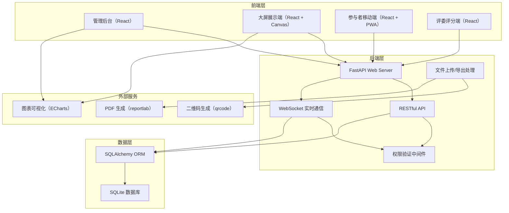
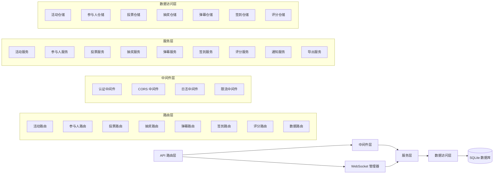
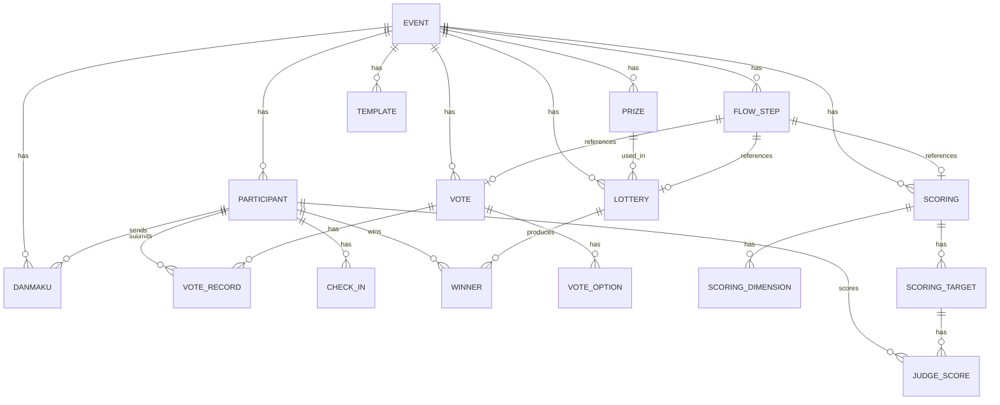

## 1. 架构设计



## 2. 技术栈说明

- **前端**：React@18 + TypeScript + Vite + TailwindCSS@3 + ECharts + Axios
- **后端**：Python@3.10 + FastAPI@0.109 + SQLAlchemy@2.0 + Pydantic@2.0
- **数据库**：SQLite（无需额外安装，文件型数据库，便于部署）
- **实时通信**：FastAPI WebSocket
- **二维码**：qrcode[pil]
- **PDF生成**：reportlab
- **验证码**：captcha
- **Excel导出**：pandas + openpyxl

## 3. 路由定义

### 前端路由

| 路由 | 页面 | 说明 |
|------|------|------|
| /login | 管理员登录页 | 系统登录入口 |
| /admin | 活动列表页 | 管理后台首页 |
| /admin/events/:id | 活动详情页 | 活动设置与管理 |
| /admin/events/:id/participants | 参与人管理 | 参与人增删改查、导入、分组 |
| /admin/events/:id/flow | 流程编排 | 环节拖拽排序、插入互动环节 |
| /admin/events/:id/votes | 投票管理 | 创建投票、查看结果 |
| /admin/events/:id/lottery | 抽奖管理 | 奖品管理、创建抽奖 |
| /admin/events/:id/danmaku | 弹幕管理 | 审核、敏感词配置 |
| /admin/events/:id/checkin | 签到管理 | 签到统计、二维码、导出 |
| /admin/events/:id/scoring | 评分管理 | 评分项创建、结果查看 |
| /admin/events/:id/dashboard | 数据仪表盘 | 实时数据展示 |
| /admin/events/:id/reports | 报告生成 | PDF报告、数据导出 |
| /display/:eventId | 大屏展示页 | 全屏互动展示 |
| /join/:eventId | 参与者入口页 | 扫码进入后的操作界面 |
| /judge/:eventId/:token | 评委评分页 | 评委专属打分页面 |

### 后端 API 路由

| 方法 | 路由 | 说明 |
|------|------|------|
| POST | /api/auth/login | 管理员登录 |
| GET | /api/events | 获取活动列表 |
| POST | /api/events | 创建活动 |
| PUT | /api/events/:id | 更新活动 |
| DELETE | /api/events/:id | 删除活动 |
| GET | /api/events/:id | 获取活动详情 |
| GET | /api/events/:id/participants | 获取参与人列表 |
| POST | /api/events/:id/participants | 添加参与人 |
| POST | /api/events/:id/participants/import | 批量导入CSV |
| PUT | /api/events/:id/participants/:pid | 更新参与人 |
| DELETE | /api/events/:id/participants/:pid | 删除参与人 |
| GET | /api/events/:id/flow | 获取流程列表 |
| PUT | /api/events/:id/flow | 更新流程排序 |
| GET | /api/events/:id/votes | 获取投票列表 |
| POST | /api/events/:id/votes | 创建投票 |
| POST | /api/votes/:id/submit | 提交投票 |
| GET | /api/votes/:id/results | 获取投票结果 |
| POST | /api/votes/:id/export | 导出投票结果 |
| GET | /api/events/:id/prizes | 获取奖品列表 |
| POST | /api/events/:id/prizes | 添加奖品 |
| GET | /api/events/:id/lotteries | 获取抽奖列表 |
| POST | /api/events/:id/lotteries | 创建抽奖 |
| POST | /api/lotteries/:id/draw | 执行抽奖 |
| GET | /api/lotteries/:id/winners | 获取中奖名单 |
| POST | /api/danmaku/send | 发送弹幕 |
| GET | /api/events/:id/danmaku | 获取弹幕列表 |
| POST | /api/danmaku/:id/approve | 审核弹幕 |
| POST | /api/danmaku/:id/pin | 置顶弹幕 |
| POST | /api/checkin/:eventId/:code | 签到 |
| GET | /api/events/:id/checkin/stats | 获取签到统计 |
| GET | /api/events/:id/checkin/qrcode | 获取签到二维码 |
| POST | /api/events/:id/scorings | 创建评分项 |
| POST | /api/scorings/:id/submit | 提交评分 |
| GET | /api/scorings/:id/results | 获取评分结果 |
| GET | /api/events/:id/dashboard | 获取仪表盘数据 |
| POST | /api/events/:id/report/pdf | 生成PDF报告 |
| GET | /api/events/:id/export | 导出全部数据 |
| WS | /ws/display/:eventId | 大屏实时推送WebSocket |
| WS | /ws/admin/:eventId | 管理端实时WebSocket |

## 4. API 数据模型（TypeScript）

```typescript
// 活动
interface Event {
  id: number;
  name: string;
  date: string;
  location: string;
  description: string;
  status: 'preparing' | 'ongoing' | 'ended';
  allowAnonymous: boolean;
  joinPassword: string | null;
  maxParticipants: number | null;
  createdAt: string;
}

// 参与人
interface Participant {
  id: number;
  name: string;
  department: string;
  tableNumber: string;
  group: string;
  phone: string;
  email: string;
  avatar: string | null;
  checkInTime: string | null;
  isLate: boolean;
  seatNumber: string | null;
  isJudge: boolean;
}

// 投票
interface Vote {
  id: number;
  eventId: number;
  title: string;
  options: VoteOption[];
  type: 'single' | 'multiple' | 'rating';
  isAnonymous: boolean;
  showResultsRealtime: boolean;
  endTime: string | null;
  status: 'pending' | 'active' | 'ended';
  maxRating: number;
}

interface VoteOption {
  id: number;
  text: string;
  voteCount: number;
}

interface VoteRecord {
  id: number;
  voteId: number;
  participantId: number | null;
  optionIds: number[];
  rating: number | null;
  deviceId: string;
  submittedAt: string;
}

// 抽奖
interface Prize {
  id: number;
  eventId: number;
  name: string;
  quantity: number;
  image: string | null;
  distributed: number;
}

interface Lottery {
  id: number;
  eventId: number;
  prizeId: number;
  name: string;
  scope: 'all' | 'group' | 'excludeWinners';
  scopeValue: string | null;
  drawMethod: 'random' | 'scroll' | 'shake';
  status: 'pending' | 'drawing' | 'completed';
  winners: Winner[];
}

interface Winner {
  id: number;
  lotteryId: number;
  participantId: number;
  participantName: string;
  participantAvatar: string | null;
  prizeName: string;
  wonAt: string;
  notified: boolean;
  claimed: boolean;
}

// 弹幕
interface Danmaku {
  id: number;
  eventId: number;
  participantId: number | null;
  content: string;
  color: string;
  fontSize: number;
  speed: number;
  status: 'pending' | 'approved' | 'rejected' | 'pinned';
  submittedAt: string;
  approvedAt: string | null;
}

// 评分
interface Scoring {
  id: number;
  eventId: number;
  name: string;
  dimensions: ScoringDimension[];
  judgeIds: number[];
  targets: ScoringTarget[];
  status: 'pending' | 'active' | 'ended';
}

interface ScoringDimension {
  id: number;
  name: string;
  weight: number;
  maxScore: number;
}

interface ScoringTarget {
  id: number;
  name: string;
  scores: JudgeScore[];
  finalScore: number | null;
}

interface JudgeScore {
  judgeId: number;
  dimensionId: number;
  targetId: number;
  score: number;
}

// 签到
interface CheckInStats {
  total: number;
  checkedIn: number;
  late: number;
  rate: number;
  checkInTrend: { time: string; count: number }[];
}
```

## 5. 后端服务架构



## 6. 数据模型

### 6.1 ER 图



### 6.2 DDL 语句

```sql
-- 活动表
CREATE TABLE events (
    id INTEGER PRIMARY KEY AUTOINCREMENT,
    name VARCHAR(255) NOT NULL,
    date DATE NOT NULL,
    location VARCHAR(255),
    description TEXT,
    status VARCHAR(20) DEFAULT 'preparing',
    allow_anonymous BOOLEAN DEFAULT FALSE,
    join_password VARCHAR(50),
    max_participants INTEGER,
    created_at DATETIME DEFAULT CURRENT_TIMESTAMP,
    updated_at DATETIME DEFAULT CURRENT_TIMESTAMP
);

-- 参与人表
CREATE TABLE participants (
    id INTEGER PRIMARY KEY AUTOINCREMENT,
    event_id INTEGER NOT NULL,
    name VARCHAR(100) NOT NULL,
    department VARCHAR(100),
    table_number VARCHAR(20),
    group_name VARCHAR(50),
    phone VARCHAR(20),
    email VARCHAR(100),
    avatar_url VARCHAR(255),
    check_in_time DATETIME,
    is_late BOOLEAN DEFAULT FALSE,
    seat_number VARCHAR(20),
    is_judge BOOLEAN DEFAULT FALSE,
    created_at DATETIME DEFAULT CURRENT_TIMESTAMP,
    FOREIGN KEY (event_id) REFERENCES events(id) ON DELETE CASCADE
);

-- 流程环节表
CREATE TABLE flow_steps (
    id INTEGER PRIMARY KEY AUTOINCREMENT,
    event_id INTEGER NOT NULL,
    name VARCHAR(100) NOT NULL,
    type VARCHAR(20) NOT NULL,
    sort_order INTEGER NOT NULL,
    vote_id INTEGER,
    lottery_id INTEGER,
    scoring_id INTEGER,
    duration INTEGER,
    created_at DATETIME DEFAULT CURRENT_TIMESTAMP,
    FOREIGN KEY (event_id) REFERENCES events(id) ON DELETE CASCADE
);

-- 投票表
CREATE TABLE votes (
    id INTEGER PRIMARY KEY AUTOINCREMENT,
    event_id INTEGER NOT NULL,
    title VARCHAR(255) NOT NULL,
    type VARCHAR(20) DEFAULT 'single',
    is_anonymous BOOLEAN DEFAULT TRUE,
    show_results_realtime BOOLEAN DEFAULT TRUE,
    end_time DATETIME,
    status VARCHAR(20) DEFAULT 'pending',
    max_rating INTEGER DEFAULT 10,
    created_at DATETIME DEFAULT CURRENT_TIMESTAMP,
    FOREIGN KEY (event_id) REFERENCES events(id) ON DELETE CASCADE
);

-- 投票选项表
CREATE TABLE vote_options (
    id INTEGER PRIMARY KEY AUTOINCREMENT,
    vote_id INTEGER NOT NULL,
    text VARCHAR(255) NOT NULL,
    vote_count INTEGER DEFAULT 0,
    sort_order INTEGER,
    FOREIGN KEY (vote_id) REFERENCES votes(id) ON DELETE CASCADE
);

-- 投票记录表
CREATE TABLE vote_records (
    id INTEGER PRIMARY KEY AUTOINCREMENT,
    vote_id INTEGER NOT NULL,
    participant_id INTEGER,
    option_ids TEXT,
    rating INTEGER,
    device_id VARCHAR(100) NOT NULL,
    captcha VARCHAR(10),
    submitted_at DATETIME DEFAULT CURRENT_TIMESTAMP,
    FOREIGN KEY (vote_id) REFERENCES votes(id) ON DELETE CASCADE
);

-- 奖品表
CREATE TABLE prizes (
    id INTEGER PRIMARY KEY AUTOINCREMENT,
    event_id INTEGER NOT NULL,
    name VARCHAR(100) NOT NULL,
    quantity INTEGER NOT NULL DEFAULT 1,
    image_url VARCHAR(255),
    distributed INTEGER DEFAULT 0,
    created_at DATETIME DEFAULT CURRENT_TIMESTAMP,
    FOREIGN KEY (event_id) REFERENCES events(id) ON DELETE CASCADE
);

-- 抽奖表
CREATE TABLE lotteries (
    id INTEGER PRIMARY KEY AUTOINCREMENT,
    event_id INTEGER NOT NULL,
    prize_id INTEGER NOT NULL,
    name VARCHAR(100) NOT NULL,
    scope VARCHAR(20) DEFAULT 'all',
    scope_value TEXT,
    draw_method VARCHAR(20) DEFAULT 'scroll',
    winner_count INTEGER DEFAULT 1,
    status VARCHAR(20) DEFAULT 'pending',
    created_at DATETIME DEFAULT CURRENT_TIMESTAMP,
    FOREIGN KEY (event_id) REFERENCES events(id) ON DELETE CASCADE,
    FOREIGN KEY (prize_id) REFERENCES prizes(id)
);

-- 中奖者表
CREATE TABLE winners (
    id INTEGER PRIMARY KEY AUTOINCREMENT,
    lottery_id INTEGER NOT NULL,
    participant_id INTEGER NOT NULL,
    prize_name VARCHAR(100) NOT NULL,
    won_at DATETIME DEFAULT CURRENT_TIMESTAMP,
    notified BOOLEAN DEFAULT FALSE,
    claimed BOOLEAN DEFAULT FALSE,
    FOREIGN KEY (lottery_id) REFERENCES lotteries(id) ON DELETE CASCADE,
    FOREIGN KEY (participant_id) REFERENCES participants(id)
);

-- 弹幕表
CREATE TABLE danmakus (
    id INTEGER PRIMARY KEY AUTOINCREMENT,
    event_id INTEGER NOT NULL,
    participant_id INTEGER,
    content TEXT NOT NULL,
    color VARCHAR(20) DEFAULT '#FFFFFF',
    font_size INTEGER DEFAULT 24,
    speed INTEGER DEFAULT 5,
    status VARCHAR(20) DEFAULT 'pending',
    submitted_at DATETIME DEFAULT CURRENT_TIMESTAMP,
    approved_at DATETIME,
    FOREIGN KEY (event_id) REFERENCES events(id) ON DELETE CASCADE
);

-- 评分表
CREATE TABLE scorings (
    id INTEGER PRIMARY KEY AUTOINCREMENT,
    event_id INTEGER NOT NULL,
    name VARCHAR(255) NOT NULL,
    status VARCHAR(20) DEFAULT 'pending',
    created_at DATETIME DEFAULT CURRENT_TIMESTAMP,
    FOREIGN KEY (event_id) REFERENCES events(id) ON DELETE CASCADE
);

-- 评分维度表
CREATE TABLE scoring_dimensions (
    id INTEGER PRIMARY KEY AUTOINCREMENT,
    scoring_id INTEGER NOT NULL,
    name VARCHAR(100) NOT NULL,
    weight DECIMAL(5,2) DEFAULT 1.0,
    max_score INTEGER DEFAULT 10,
    FOREIGN KEY (scoring_id) REFERENCES scorings(id) ON DELETE CASCADE
);

-- 评分对象表
CREATE TABLE scoring_targets (
    id INTEGER PRIMARY KEY AUTOINCREMENT,
    scoring_id INTEGER NOT NULL,
    name VARCHAR(100) NOT NULL,
    final_score DECIMAL(8,2),
    FOREIGN KEY (scoring_id) REFERENCES scorings(id) ON DELETE CASCADE
);

-- 评委评分表
CREATE TABLE judge_scores (
    id INTEGER PRIMARY KEY AUTOINCREMENT,
    scoring_id INTEGER NOT NULL,
    judge_id INTEGER NOT NULL,
    dimension_id INTEGER NOT NULL,
    target_id INTEGER NOT NULL,
    score INTEGER NOT NULL,
    submitted_at DATETIME DEFAULT CURRENT_TIMESTAMP,
    FOREIGN KEY (scoring_id) REFERENCES scorings(id) ON DELETE CASCADE,
    FOREIGN KEY (judge_id) REFERENCES participants(id),
    FOREIGN KEY (dimension_id) REFERENCES scoring_dimensions(id),
    FOREIGN KEY (target_id) REFERENCES scoring_targets(id)
);

-- 活动模板表
CREATE TABLE templates (
    id INTEGER PRIMARY KEY AUTOINCREMENT,
    name VARCHAR(100) NOT NULL,
    description TEXT,
    flow_data TEXT NOT NULL,
    created_at DATETIME DEFAULT CURRENT_TIMESTAMP
);

-- 管理员表
CREATE TABLE admins (
    id INTEGER PRIMARY KEY AUTOINCREMENT,
    username VARCHAR(50) UNIQUE NOT NULL,
    password_hash VARCHAR(255) NOT NULL,
    name VARCHAR(50),
    created_at DATETIME DEFAULT CURRENT_TIMESTAMP
);

-- 弹幕敏感词表
CREATE TABLE sensitive_words (
    id INTEGER PRIMARY KEY AUTOINCREMENT,
    word VARCHAR(50) NOT NULL,
    created_at DATETIME DEFAULT CURRENT_TIMESTAMP
);

-- 索引
CREATE INDEX idx_participants_event_id ON participants(event_id);
CREATE INDEX idx_votes_event_id ON votes(event_id);
CREATE INDEX idx_lotteries_event_id ON lotteries(event_id);
CREATE INDEX idx_danmakus_event_id ON danmakus(event_id);
CREATE INDEX idx_danmakus_status ON danmakus(status);
CREATE INDEX idx_winners_participant ON winners(participant_id);
```
