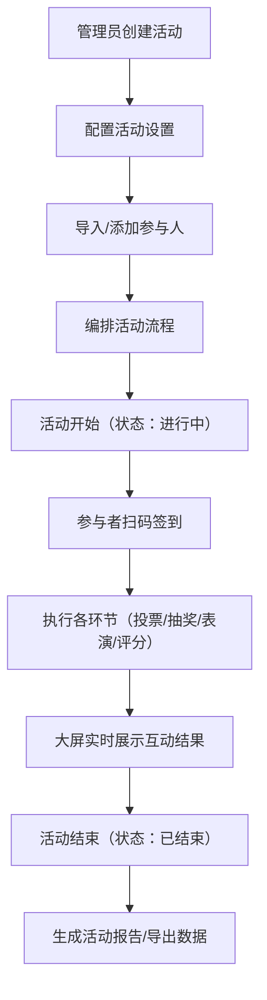

## 1. 产品概述

TallyBox 是一款面向公司年会现场互动的全功能工具，解决年会投票、抽奖、签到、弹幕墙等环节的组织难题，让活动组织者从容应对各类互动场景。

- 核心目标：将年会互动环节数字化、自动化，减少人工操作失误，提升现场参与感和互动体验
- 目标用户：公司行政/HR/年会组织者、现场参与者、大屏观众

## 2. 核心功能

### 2.1 用户角色

| 角色 | 注册方式 | 核心权限 |
|------|----------|----------|
| 管理员 | 系统登录 | 活动全生命周期管理、投票/抽奖/弹幕/签到/评分全功能操作、数据导出、报告生成 |
| 评委 | 扫码进入 | 针对评分项进行维度打分 |
| 参与者 | 扫码/输入密码 | 投票、抽奖、发弹幕、签到、查看中奖通知 |
| 大屏观众 | 无需登录 | 观看投票结果、抽奖动画、弹幕墙、签到统计等实时展示 |

### 2.2 功能模块

1. **活动管理**：活动创建与设置、参与人管理、分组、流程编排、模板保存
2. **投票功能**：投票创建、实时投票、防作弊、结果展示与导出
3. **抽奖功能**：奖品管理、抽奖动画、中奖展示、自动排除已中奖者
4. **弹幕墙**：弹幕发送、审核、过滤、样式配置、置顶
5. **签到系统**：扫码签到、迟到标记、座位分配、签到统计
6. **评分功能**：多维度评分、实时汇总、去高低分取平均、排行榜
7. **数据总览**：仪表盘、参与度统计、活跃度排行、活动回放、报告生成

### 2.3 页面详情

| 页面名称 | 模块名称 | 功能描述 |
|----------|----------|----------|
| 管理员登录页 | 登录模块 | 用户名密码登录，权限验证 |
| 活动列表页 | 活动管理 | 活动列表展示、新建、编辑、删除、状态切换 |
| 活动设置页 | 活动配置 | 基本信息、参与设置（匿名/密码/人数限制） |
| 参与人管理页 | 参与人管理 | 手动添加、批量导入CSV、扫码加入、分组管理 |
| 流程编排页 | 流程管理 | 环节列表、拖拽排序、插入投票/抽奖/评分环节 |
| 模板管理页 | 模板管理 | 保存常用流程模板、加载模板 |
| 投票管理页 | 投票管理 | 创建投票、编辑选项、设置投票类型、开启/结束投票 |
| 抽奖管理页 | 抽奖管理 | 奖品录入、创建抽奖、设置参与范围、开始抽奖 |
| 弹幕管理页 | 弹幕管理 | 审核开关、敏感词配置、弹幕审核、置顶操作 |
| 签到管理页 | 签到管理 | 生成签到二维码、查看签到统计、导出签到数据 |
| 评分管理页 | 评分管理 | 创建评分项、配置评委、查看评分结果、导出数据 |
| 数据仪表盘 | 数据总览 | 实时数据展示、各环节统计、活跃度排行 |
| 报告生成页 | 数据总览 | PDF活动报告、历史对比、数据导出 |
| 大屏展示页 | 大屏端 | 投票结果柱状图、抽奖滚动动画、弹幕墙、签到动画 |
| 参与者页面 | 参与端 | 扫码进入、投票、发弹幕、签到、查看中奖通知 |
| 评委评分页 | 评委端 | 多维度打分、提交评分 |

## 3. 核心流程

## 4. 用户界面设计

### 4.1 设计风格

- **主色调**：中国红（#E53935）作为主色，配合金色（#FFD700）点缀，营造年会喜庆氛围
- **辅助色**：深灰蓝（#1A237E）作为背景主色，白色（#FFFFFF）文字，形成高对比度
- **按钮风格**：圆角按钮，悬停时有微放大和发光效果，主按钮使用渐变背景
- **字体**：标题使用具有设计感的「站酷文艺体」或「思源黑体 Bold」，正文使用「思源黑体 Regular」
- **布局风格**：卡片式布局，深色主题背景，配合霓虹光效和粒子背景动画
- **图标风格**：线性图标，统一使用红色主色调，重要状态使用金色高亮

### 4.2 页面设计概述

| 页面名称 | 模块名称 | UI 元素 |
|----------|----------|---------|
| 大屏展示页 | 实时结果 | 深色渐变背景、动态粒子效果、大型柱状图带增长动画、滚动抽奖名单Canvas动画、弹幕从右向左滚动带拖尾效果 |
| 管理员后台 | 仪表盘 | 数据卡片带悬浮动效、侧边栏导航、顶部状态栏、数据可视化图表（ECharts） |
| 参与者页面 | 移动端 | 简洁卡片式、大按钮便于操作、红色主题、扫码进入后自动识别身份 |

### 4.3 响应式

- 桌面端优先设计，适配管理员后台操作
- 移动端自适应，针对参与者手机端优化触摸交互
- 大屏端专门优化，大字号、高对比度、动画流畅
- 支持横竖屏切换，大屏端强制横屏显示

### 4.4 动画与交互

- 投票结果更新：柱状图高度平滑过渡，数字滚动动画
- 抽奖动画：Canvas实现名字滚动效果，逐渐减速定格，中奖者名字放大并金色光芒环绕
- 弹幕墙：弹幕带透明度渐变进入/退出，置顶弹幕固定顶部带金色边框
- 签到动画：签到人数数字跳动，头像从屏幕四周飞入汇聚成圆形
- 页面切换：左右滑入过渡，配合淡入淡出效果
